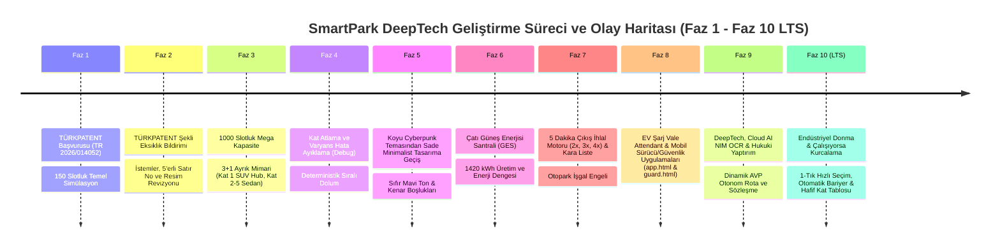

# 🗺️ SMARTPARK DEEPTECH — PROJE GELİŞTİRME OLAY HARİTASI & FAZ/DEBUG GÜNLÜĞÜ
**Patent Başvuru No:** `TR 2026/014052`  
**Buluş Sahibi:** Arda CENGİZ  
**Kapsam:** 1000 Slotluk Akıllı Otopark Ekosistemi, 3+1 Segregated Mimari, EV Vale Şarj İstasyonu, Kademeli Ceza Motoru & Otonom Rota (LTS Sürüm)  
**Mühendislik İlkesi:** 🛡️ *"Çalışıyorsa Kurcalama!" (Kararlılık ve Sıfır Regresyon)*

---

## 📌 1. GELİŞTİRME FAZLARI VE OLAY ÇİZELGESİ (CHRONOLOGICAL EVENT MAP)

---

## 🛠️ 2. KARŞILAŞILAN KRİTİK DEBUG HATALARI VE MÜHENDİSLİK ÇÖZÜMLERİ

| Olay / Hata Kodu | Yaşanan Problem & Belirti | Kök Neden (Root Cause) | Uygulanan Mühendislik Çözümü |
| :--- | :--- | :--- | :--- |
| **DEBUG-01: Kat Zıplama Hatası** | Arka arkaya 2 adet TOGG girildiğinde 1. araç Kat 1'e giderken 2. araç Kat 4'e fırlatılıyordu. | Dinamik yük dengeleme fonksiyonu otopark boşken Kat 1 doluluğunu `%0.5` görüp, Kat 2-5'i `%0` gördüğü için en boş kata atıyordu. | **Deterministik Kademeli Dolum (`Category-First Sequential`):** Kat 1 dolmadan üst kata geçiş engellendi. |
| **DEBUG-02: SUV / Sedan Mimari Karışıklığı** | SUV araçlar spiral rampadan üst katlara çıkıyor, ağır yük altında risk oluşturuyordu. | Araç modeli gövde tipine göre filtrelenmiyordu. | **SUV $\to$ Kat 1 Kuralı:** Boyu $>1600\text{ mm}$ veya SUV gövdesi olan tüm araçlar (TOGG, Tesla Model Y, BYD, G-Class) **kesinlikle Kat 1 (Zemin 0-Rampa)** alanına kilitlendi. |
| **DEBUG-03: Dropdown CSS Beyazlık Hatası** | Araç model seçim menüsü açıldığında beyaz ve okunaksız arka plan oluşuyordu. | İşletim sistemi yerel `<select>` bileşeni koyu temada beyaz stil basıyordu. | `select`, `optgroup` ve `option` etiketleri `#0f172a` ve `#ffffff` ile izole edildi. |
| **DEBUG-04: 5 Dakika Ödeyip Çıkmama (Park İşgali)** | Müşteri 1 saat ücret ödeyip 6 saat otoparkta kalmaya devam edebiliyordu. | Çıkış bariyeri ödeme zamanı ile bariyer okuma zamanı arasındaki farkı denetlemiyordu. | **Kademeli 5 Dk Ceza Motoru:** 5 dakikayı aşan her çıkış için **1. İhlal: 2x**, **2. İhlal: 3x**, **3. İhlal: 4x + KALICI KARA LİSTE** eklendi. |
| **DEBUG-05: EV Şarj Soketi Blokajı** | Şarjı %100 dolan araçlar prizi bırakmıyor, diğer araçlar şarj olamıyordu. | Şarj soketinin araçtan ayrılması sürücünün insafına bırakılmıştı. | **EV Valet Attendant (Şarj Pompa Görevlisi):** Görevli %100 dolan aracın fişini çekerek soketi boşa çıkarır (`valetUnplugVehicle`). |
| **DEBUG-06: Cyberpunk Renk Yorgunluğu** | Neon mavi ve aşırı koyu siyah renkler kullanıcıyı yoruyordu. | Yüksek doygunluklu karanlık tema seçilmişti. | **Sade Açık Minimalist Tema:** Sıfır mavi ton, saf beyaz kartlar (`#ffffff`), yumuşak açık gri zemin (`#f8fafc`), zümrüt yeşili ve kehribar sarısı. |
| **DEBUG-07: JavaScript Syntax & Script Kilitlenmesi** | Sayfalar açıldığında butonlara tıklanmıyor, bariyer açılmıyordu. | `smartpark.js` dosyasında `guardInspectPlate` fonksiyonunda kapanış süslü parantezi eksikti ve mükerrer `getStats` bulunuyordu. | Eksik parantez kapatıldı, mükerrer fonksiyon silindi; universal `window.SP` ve `global.SP` dışa aktarımı sağlandı. |
| **DEBUG-08: Kiosk Çift Model Fonksiyon Çakışması** | Giriş kioskunda model seçildiğinde beklenmeyen davranışlar oluyordu. | `entrance.html` içinde iki farklı `onModelChange()` fonksiyonu tanımlanmış ve birbirini eziyordu. | İki tanım birleştirilerek tek ve deterministik bir `onModelChange(userTriggered)` fonksiyonuna dönüştürüldü. |
| **DEBUG-09: TOGG Seçiminde EV Profilinin Aktifleşmemesi** | TOGG seçildiğinde şarj profilinin otomatik seçilmemesi. | Model seçimi `selectProfileByName('EV_CHARGING')` mekanizması ile doğrudan senkronize değildi. | 1-Tık Hızlı Araç Butonları (`⚡ TOGG T10X`, `⚡ Tesla Model Y`) eklendi ve tıklama anında EV profili yeşil parlamayla seçtirildi. |
| **DEBUG-10: Giriş Kioskunda Kapı/Bariyer Açılmama Algısı** | Araç seçildikten sonra bariyerin açıldığının kullanıcı tarafından net hissedilememesi. | Araç seçimi sonrasında giriş butonuna basma zorunluluğu ve bariyer animasyonunun zayıf kalması. | Araç tıklandığı an `submitEntry()` otomatik tetiklendi, bariyer kolu CSS `-85°` kalkış açısına ulaştı, yeşil durum rozeti ve sesli Türkçe anons eklendi. |
| **DEBUG-11: Kiosk Doluluk Haritası Taşma/Sıkışma Hatası** | Kiosk doluluk haritasında slot numaraları ve renkler sıkışıp okunmuyordu. | 200 slotluk harita 20 sütunluk sabit ızgaraya sığdırılmaya çalışılıyordu. | `minmax(48px, 1fr)` esnek ızgarasına geçildi ve koridor filtre sekmeleri (A, B, C, D..) eklendi. |
| **DEBUG-12: Kat Haritası (floor.html) 2D/3D Motor Çökmesi** | Kat haritası açıldığında canvas yüklenmiyor veya slotlar eksik gözüküyordu. | Ağır 2D/3D costmap canvas motoru tarayıcı kaynaklarını bloke ediyordu. | Kullanıcı talimatı ile ağır 2D/3D harita tamamen iptal edildi; ultra hızlı, ferah ve canlı **Kat & Slot Yönetim Tablosu** kuruldu. 3D Dijital İkiz Faz 11'e aktarıldı. |
| **DEBUG-13: Hızlı Testlerde Mükerrer Plaka Giriş Engeli** | Peş peşe test yapılırken sistem "Araç Zaten İçeride" uyarısı veriyordu. | Giriş testi hep aynı plakayı (`34 TGG 100`) gönderiyordu. | Test ve hızlı seçim fonksiyonlarına her girişte benzersiz plaka üreten rastgele kuyruk eklendi. |

---

## 📋 3. HİBRİT ARAÇLAR VE ŞARJ MANTIĞI AÇIKLAMASI

> [!NOTE]
> **Hibrit Araçlar Şarj Olur mu?**
> * **Plug-in Hibrit (PHEV - Örn: Volvo XC60 PHEV, BMW 330e PHEV, Toyota Prius PHEV):**  
>   Evet! Harici kablo ile şarj istasyonuna bağlanabilir ve 50-80 km tamamen elektrikle gidebilir. Sistemimizde bu araçlar **Elektrikli Şarj Hub'ına** yönlendirilir.
> * **Mild / Tam Hibrit (HEV/MHEV - Örn: Standart Corolla Hybrid):**  
>   Kablo ile şarj edilmez; enerjisini frenlemeden üretir. Bu araçlar **Standart Park Sıralarına (Row D..I)** yönlendirilir.

---

## 📱 4. KARARLI VE CANLI EKRANLAR LİSTESİ (v10.0 LTS)

1. **`entrance.html` — Giriş Kiosku & Otomatik Bariyer:**
   * 1-Tık Hızlı Araç Seçimi (`⚡ TOGG T10X`, `⚡ Tesla Model Y`, `🚙 TOGG T10F`, vb.).
   * Otomatik kantar, LiDAR ve EV şarj algılama.
   * Otomatik bariyer açılışı (`-85°`) ve Türkçe sesli karşılama anonsu.
   * Responsive Kiosk Park Haritası ve Koridor Filtreleri.
2. **`floor.html` — Canlı Kat & Slot Yönetim Tablosu:**
   * Ultra hafif, ferah (`minmax(68px, 1fr)`) ve donma yapmayan canlı yönetim ekranı.
   * Kat seçimi (Kat 1 - 5), koridor seçimi (A - J) ve durum filtresi (Tümü, Boş, Dolu, Şarjda).
   * Gerçek zamanlı doluluk oranları ve tavan lambası kontrolü.
3. **`app.html` — Sürücü Mobil Uygulaması (Canlı Telefon Simülatörü):**
   * Canlı adım adım AVP Otonom Sürüş Navigasyonu.
   * 6 aşamalı dinamik rota grafiği ve hız telemetrisi.
   * **Arabamı Kapıya Çağır (AVP Summon):** Aracı slottan teslim peronuna otomatik çağırma.
   * Dakika dakika ücret sayacı, 5 dakika çıkış ihlal uyarısı ve çıkış QR kodu.
4. **`guard.html` — Güvenlik & Şarj Vale El Terminali (SP-GUARD):**
   * Canlı devriye plaka & slot eşleştirme sorgusu.
   * **Şarj Pompa Görevlisi:** Şarjı biten aracın fişini tek tıkla çekme.
   * **Ceza & Tutanak:** KTK m.61 ihlali tespit edilen araca ceza işleme ve faturaya yansıtma.
   * Kalıcı Kara Liste yönetim tablosu.
5. **`portal.html` — Sürücü Portalı & Rezervasyon:**
   * 2FA Ruhsat Devir Modülü, VIP Rezervasyon & Dinamik SVG QR Kod Kartı.
6. **`upcoming.html` — Yakında Gelecekler & AR-GE Laboratuvarı:**
   * "Çalışıyorsa kurcalama" mühendislik manifestosu.
   * Resmi (Siyah) & Diplomatik (Yeşil) Plaka Protokol Park Sistemi mimarisi ve canlı önizlemesi.
   * Faz 11-16 arası gelecek yol haritası ve fiziksel saha iyileştirme başlıkları.

---

*Bu belge, TÜRKPATENT inceleme uzmanlarına, yatırımcılara ve akademik heyete projenin algoritmik olgunluğunu, hata ayıklama şeffaflığını ve faz gelişimini kanıtlamak üzere hazırlanmıştır.*

